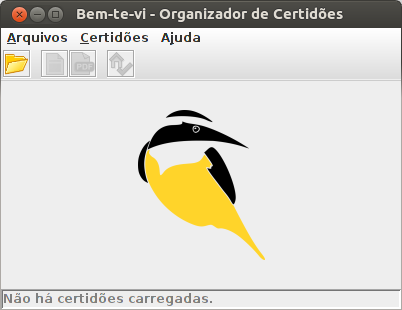
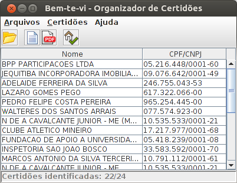
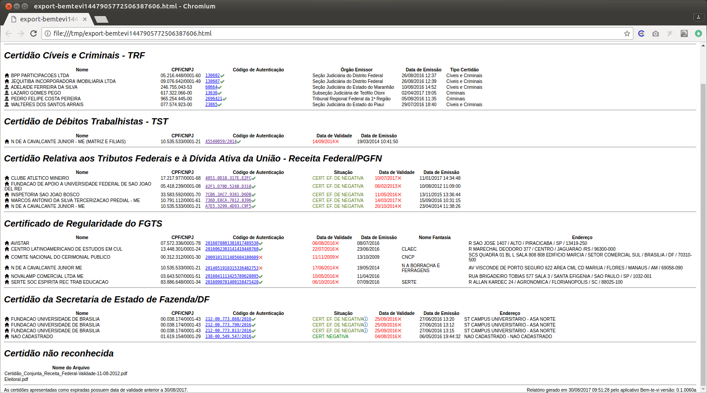

# Bem-te-vi

 

O <b>Bem-te-vi</b> é um aplicativo destinado a auxiliar no gerenciamento, catalogação e validação de arquivos de certidões pública brasileiras. 
As certidões precisam estar no formato PDF em modo pesquisável (não são aceitos arquivos escaneados).

O principal público alvo desse aplicativo são órgãos, entidades e empresas que necessitam analisar sistematicamente certidões emitidas por órgãos públicos, tais como nada-consta da Receita, certidões criminais, etc. Consulte abaixo a lista de certidões que o Bem-te-vi é capaz de validar.

### Certidões Aceitas

As certidões atualmente aceitas pelo Bem-te-vi são:
* Caixa Econômica Federal: Certificado de Regularidade do FGTS (CRF)
* Receita Federal/PGFN: Certidão Relativa aos Tributos Federais e à Dívida Ativa da União
* Sefaz/DF: Certidão da Secretaria de Estado de Fazenda/DF
* TJDFT: Certidão de Distribuição
* TRF: Certidão Cíveis e Criminais
* TRT 10º Região: Certidão de Distribuição de Ações Trabalhistas
* TST: Certidão de Débitos Trabalhistas

### Processo de Validação

O processo de validação das certidões é dividido em duas etapas: 

1. identificar o tipo de certidão, extraindo todas as informações existentes tais como Nome, CPF/CNPJ, código de autenticação, data de validade, etc; 

2. Validar o código de autenticação no site do órgão emissor, conferindo se a certidão é válida e se existe alguma informação adulterada. 

### Download

Última Versão: 0.1.0060a

Download: [bemtevi-0.1.0060a.jar](versoes/bemtevi-0.1.0060a.jar?raw=true)

### Pré-requisitos de Sistema

Java versão 7 ou superior

### Observações:

Por se tratar de um software de uso gratuito, os desenvolvedores se eximem de qualquer responsabilidade por falhas e erros que possam ocorrer na ferramenta ou por problemas derivados a partir de seu uso. As certidões originais, emitidas pelos órgãos do poder público, devem ser consideradas as únicas fontes de informação juridicamente válidas. Deste modo, o uso das informações e relatórios produzidos pela ferramenta é de inteira responsabilidade do usuário e devem ser verificadas com as fontes originais.

### Screenshots:

| Janela Principal: | Certidões Carregadas: | 
|:---:|:---:|
|   |  

| Relatório de Validação: |
|:---:|
|  |

